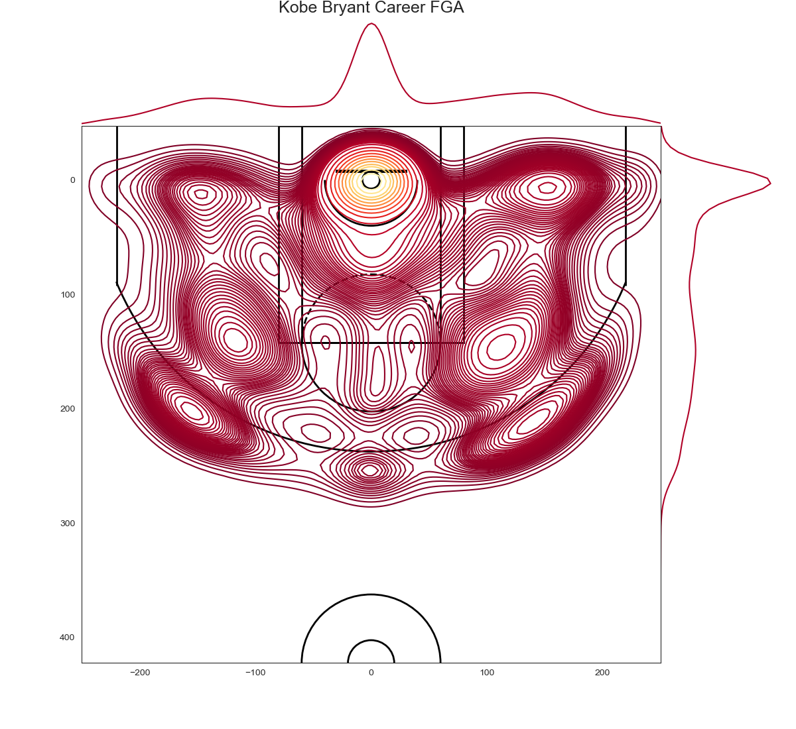

# Simple shoting analysis 
## FGA Analysis (Field Goals Attempted) 

In basketball, a field goal is a basket scored on any shot or tap other than a free throw, worth two or three points depending on the distance of the attempt from the basket. Uncommonly, a field goal can be worth other values such as one point in FIBA 3x3 basketball competitions or four points in the BIG3 basketball league. "Field goal" is the official terminology used by the National Basketball Association (NBA) in their rule book, in their box scores and statistics, and in referees' rulings. The same term is also the official wording used by the National Collegiate Athletic Association (NCAA) and high school basketball.

One type of field goal is called a slam dunk. This occurs when a player jumps near the basket with possession of the ball, throwing the ball down through the basket while airborne.

* Kareem Abdul-Jabbar holds the NBA record for field goals made in a career with 15,837. 
* Wilt Chamberlain, one of the most prolific scorers of all time, holds the top four spots for most field goals made in a season and has the second highest field goal percentage for a season (72.7%). The highest field goal percentage for a single season was set by New York Knicks center Mitchell Robinson with 74.2% in the abbreviated 2019–20 season. One of the greatest field-goal shooters of all time is Michael Jordan, who led the NBA in field goals made ten times. 

* Shaquille O'Neal has the record for most seasons (10) with the best field goal percentage, and Artis Gilmore has the record for highest career field goal percentage (59.9%).
* Steve Nash was one of the greatest all-around shooters in the history of the NBA, holding the record for 50–40–90 seasons, a mark of all-around shooting for two-point field goals, three-point field goals, and free throws. Nash recorded four of the eleven 50–40–90 seasons in NBA history.

### Kobe Career FGA

    

